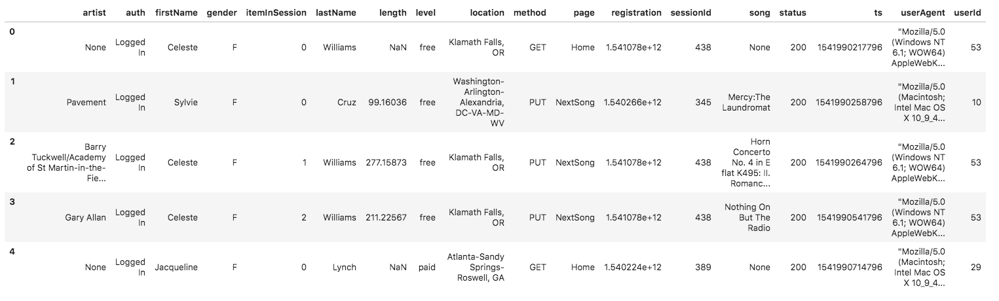
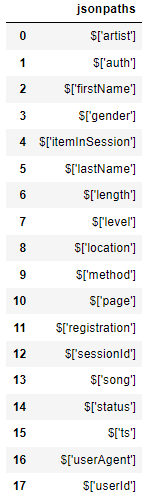

You'll be working with two datasets stored in S3. Here are the S3 links for each:

    Song data: s3://udacity-dend/song_data
    Log data: s3://udacity-dend/log_data

To properly read log data s3://udacity-dend/log_data, you'll need the following metadata file:

    Log metadata: s3://udacity-dend/log_json_path.json

to two files in this dataset.

song_data/A/B/C/TRABCEI128F424C983.json  
song_data/A/A/B/TRAABJL12903CDCF1A.json  

And below is an example of what a single song file, TRAABJL12903CDCF1A.json, looks like.  

{"num_songs": 1,  
 "artist_id": "ARJIE2Y1187B994AB7",  
 "artist_latitude": null,  
 "artist_longitude": null,  
 "artist_location": "",  
 "artist_name": "Line Renaud",  
 "song_id": "SOUPIRU12A6D4FA1E1",  
 "title": "Der Kleine Dompfaff",  
 "duration": 152.92036,  
 "year": 0  
}   

Log Dataset

Schema for Song Play Analysis

Using the song and event datasets, you'll need to create a star schema optimized for queries on song play analysis. This includes the following tables.  

    songplays - records in event data associated with song plays i.e. records with page NextSong   

Fact Table  
        songplay_id, start_time, user_id, level, song_id, artist_id, session_id, location, user_agent

Dimension Tables  
    users - users in the app
        user_id, first_name, last_name, gender, level

    songs - songs in music database
        song_id, title, artist_id, year, duration

    artists - artists in music database
        artist_id, name, location, latitude, longitude

    time - timestamps of records in songplays broken down into specific units
        start_time, hour, day, week, month, year, weekday
  
